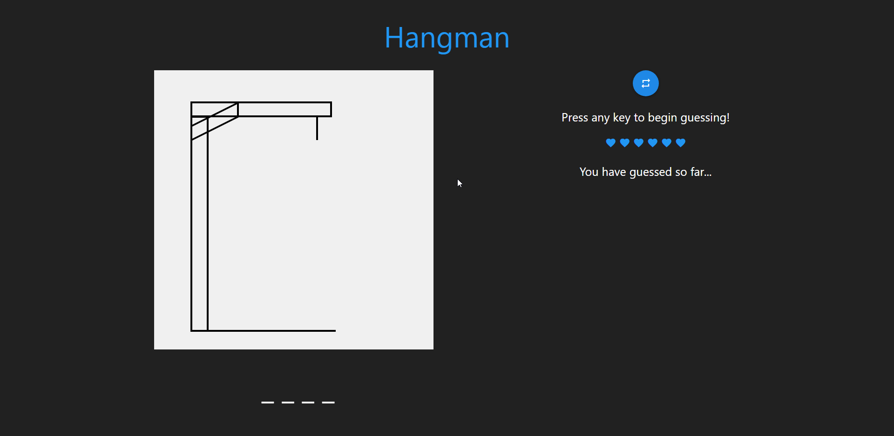
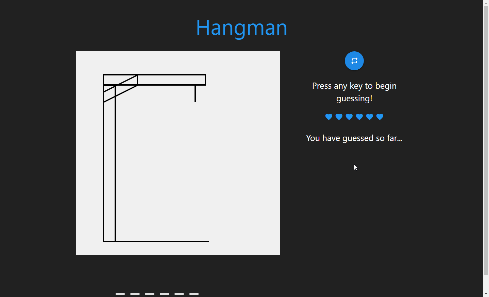
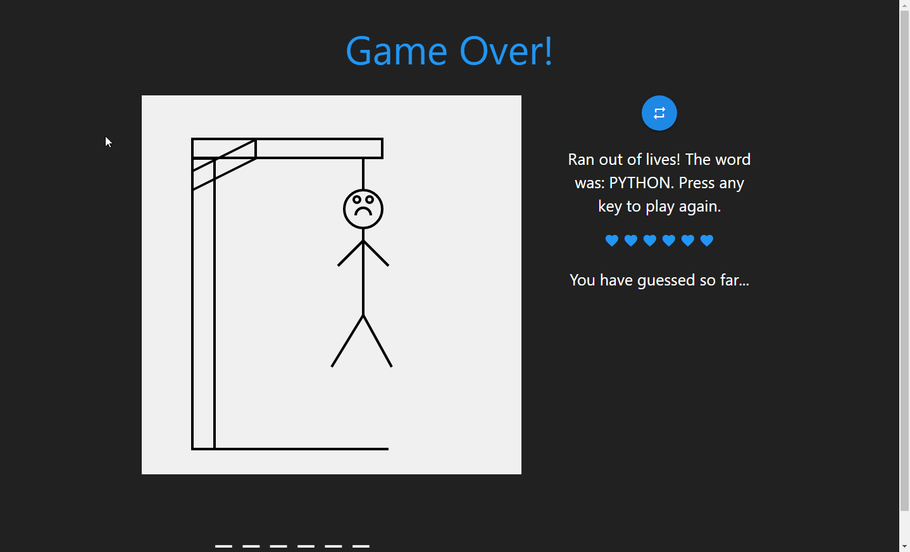

# Vanilla Javascript Hangman

### Description

Press any key to start playing game. Game will read in any character input as guesses for the unknown word. You have 6 lives and lose a life on a wrong guess. Game ends once you run out of lives or guess the word. Game automatically selects new word for you to guess once a game is finished. You can also hit the reset button to start a new game at any time.

### Gameplay

